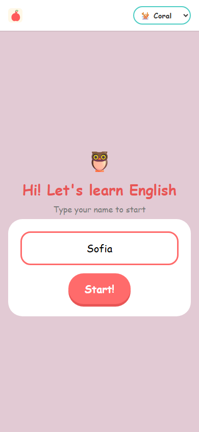
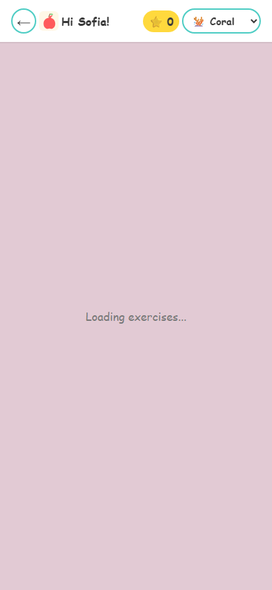

# Teacher's Pet

A mobile-first PWA for kids aged 7–12 to practice English. The student enters their name,
picks a level (A1–C2) and difficulty, and solves exercises (multiple-choice, fill-blank,
matching, word-order), earning a point per completed exercise — no account needed.

There's also a teacher dashboard behind auth (`/auth`, `/admin/dashboard`,
`/admin/exercises`) to track student progress and manage the exercise catalog.

| Student                                          | Teacher                                            |
| ------------------------------------------------ | -------------------------------------------------- |
|  |  |

## Stack

- **Vite + React + TypeScript**, functional components with hooks.
- **styled-components** for all styling, with a centralized theme (`src/styles/theme.ts`) and
  5 color palettes the student can pick from.
- **PWA, mobile-first** via `vite-plugin-pwa` (manifest + service worker).
- **`react-router-dom`** only for the teacher-facing routes (`/auth`, `/admin/*`); the student
  goes through their whole flow on `/` without ever changing URL.
- **Neon (Postgres)** for persistence, via Vercel serverless functions under `/api/*.ts`
  (`@neondatabase/serverless`). The browser never talks to the database directly.
- **Neon Auth** (Managed Better Auth) for the teacher session, backed by an email allowlist as
  the actual access barrier (`api/_auth.ts`).

## Architecture

```
api/            Vercel serverless functions (student session, attempts, progress, exercise
                catalog, protected teacher endpoints)
src/
  pages/        StudentFlow (student) and Auth/AdminDashboard/AdminStudentDetail/AdminExercises
                (teacher)
  steps/        screens of the student flow (Welcome, LevelSelect, DifficultySelect, Exercise,
                Summary)
  components/   exercises/ (one component per exercise type), admin/, ui/, layout/
  state/        StudentContext (useReducer) and TeacherContext (teacher session), kept separate
  lib/          fetch wrappers to /api (api.ts for the student, adminApi.ts for the teacher),
                auth.ts (Neon Auth client)
  styles/       theme.ts + the 5 palettes + GlobalStyle
```

Exercises and student progress live in Neon, not in static files. Full details on the data
model, `/api` contract, code conventions and security rules live in
[CLAUDE.md](CLAUDE.md) — it's the authoritative reference for this project, read it before
touching code.

## Running locally

```sh
npm install
npm run dev        # frontend only (http://localhost:5173)
npm run dev:api     # frontend + /api against Neon, via vercel dev (needed for /auth and /admin/*)
```

Requires a `.env.local` (not committed) with `DATABASE_URL` (Neon) and
`NEON_AUTH_BASE_URL`/`VITE_NEON_AUTH_URL`/`ALLOWED_TEACHER_EMAILS` for teacher auth — see
"Teacher auth" in [CLAUDE.md](CLAUDE.md).

## Verify before committing

```sh
npm run format:check
npx tsc --noEmit
npm run lint
```
